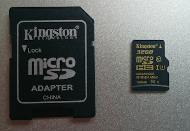
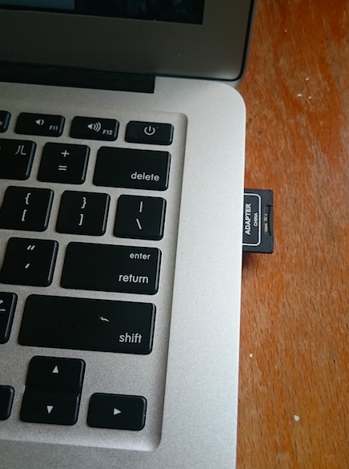
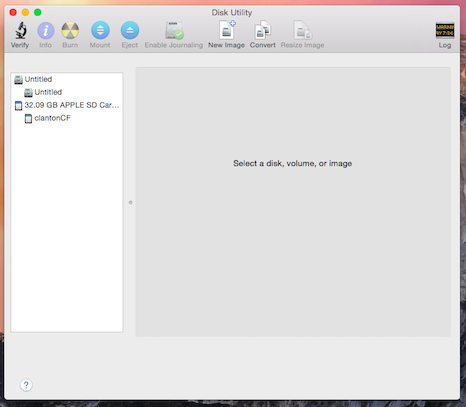
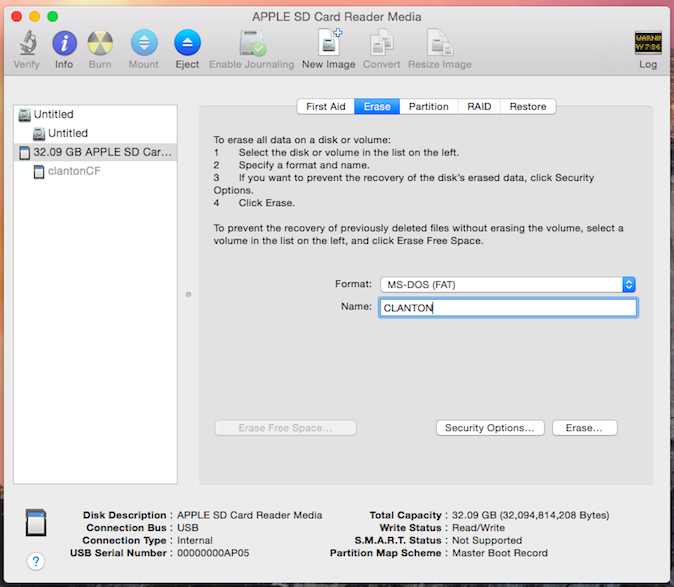

# Boot From SD Card

## Getting image
You can get the Galileo's linux image by following [Building Galileo Image on Debian](building_galileo_image_from_debian.md), or download it [here]('http://sourceforge.net/projects/ndn-in-one/files/image.tar.gz), they are the same

## Preparing SD card
If you don't have a micro SD card reader, get a micro to SD card converter.


We need to format the SD card and make sure it has correct partition before we copy kernel images on it.
* SD card should have partition type `master boot record`
* SD card should have one partition of type `FAT 32`

After SD card is prepared, simply copy all five files/folder in the image to SD card
1. boot/
2. grub.efi
3. bzImage
4. core-image-minimal-initramfs-clanton.cpio.gz
5. image-full-galileo-clanton.ext3

## Example on Debian 7.8
To demontrate how it is done on Debian 7.8, let's use GUI Disk util in `Applications/Accessories/Dist Utility`

1. Select Format Drive, and format the SD card into `master boot record`
2. Select Add Partition, then add a `FAT` partition
3. Now you can copy everything to SD card


```
cp -r boot/ bzImage core-image-minimal-initramfs-clanton.cpio.gz grub.efi image-full-galileo-clanton.ext3 /media/clantonCF/
```

# Example no Mac Yosemite
1. Insert your SD card

2. Open Disk Utility

3. Format the SD card
